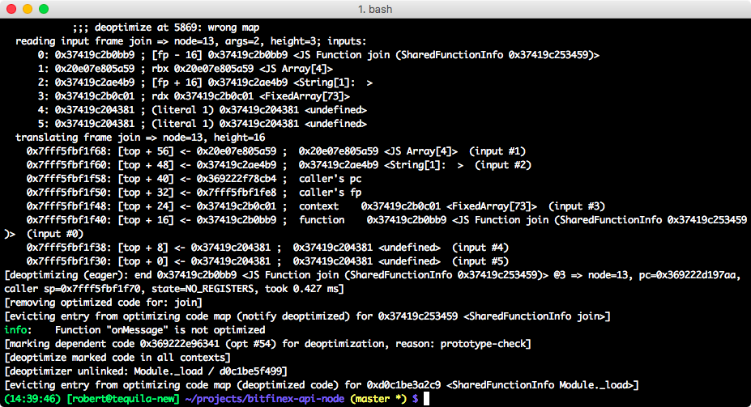

# deopty

Find out if a JS function is optimized by V8.

further reference:

http://v8-io12.appspot.com/#63

## Examples

Run Examples in the repo:

```
$ node --trace_opt --trace_deopt --allow-natives-syntax example-deoptimized.js

$ node --trace_opt --trace_deopt --allow-natives-syntax example-optimized.js

```

### Real-World-Example

From https://github.com/bitfinexcom/bitfinex-api-node/blob/3608855042f7f0bed27dc548ed7fe6fb2e023b95/ws2.js

```diff
diff --git a/ws2.js b/ws2.js
index 729e6b7..a1d3e19 100644
--- a/ws2.js
+++ b/ws2.js
@@ -6,6 +6,8 @@ const crypto = require('crypto')
 const WebSocket = require('ws')
 const util = require('util')

+const wrapOptimizedTest = require('./deopty')
+
 /**
  * Handles communitaction with Bitfinex WebSocket API.
  * @param {string} APIKey
@@ -21,7 +23,7 @@ class BitfinexWS2 extends EventEmitter {
     this.api_secret = api_secret
     this.websocketURI = 'wss://api.bitfinex.com/ws/2'
     this.ws = new WebSocket(this.websocketURI)
-    this.ws.on('message', this.onMessage.bind(this))
+    this.ws.on('message', wrapOptimizedTest(this.onMessage).bind(this))
     this.ws.on('open', this.onOpen.bind(this))
     this.ws.on('error', this.onError.bind(this))
     this.ws.on('close', this.onClose.bind(this))

```

Let it run until the test finishes.


